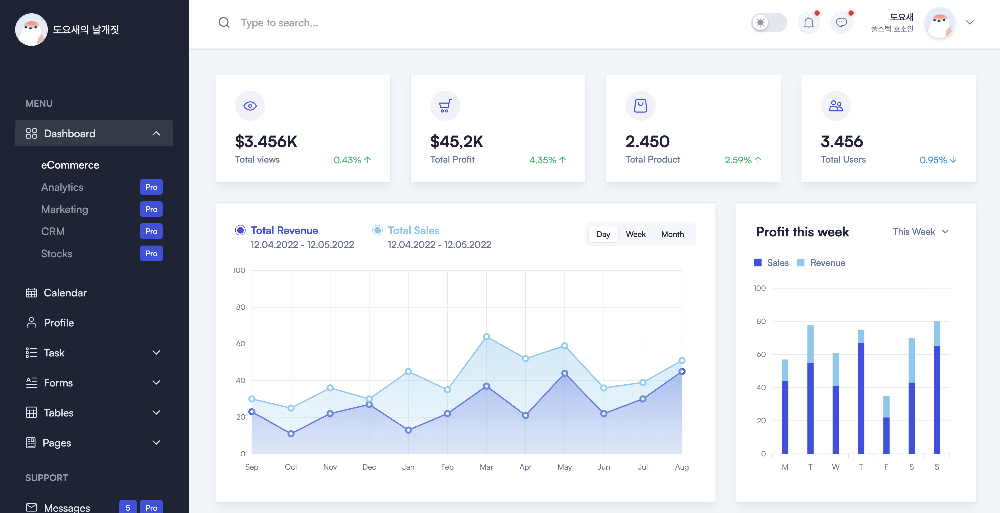
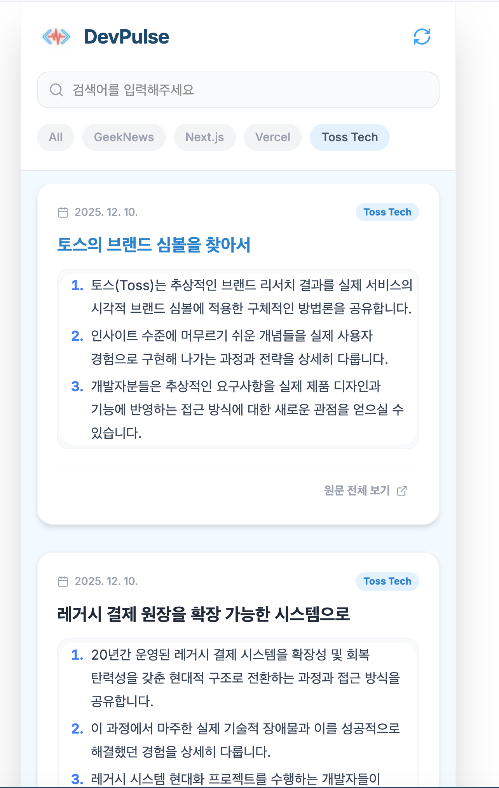
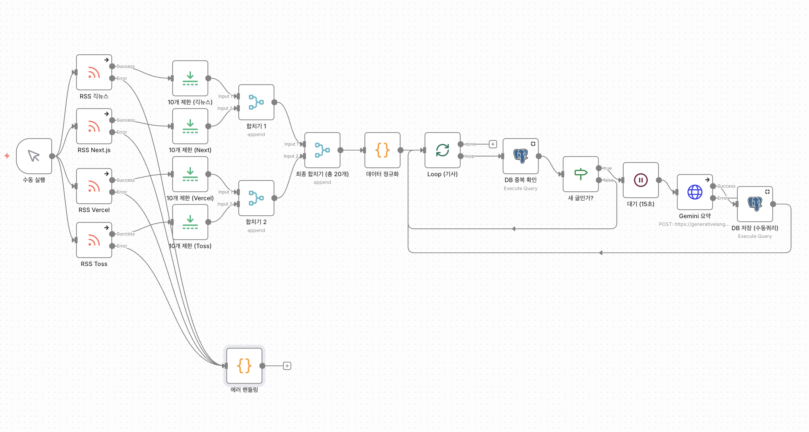
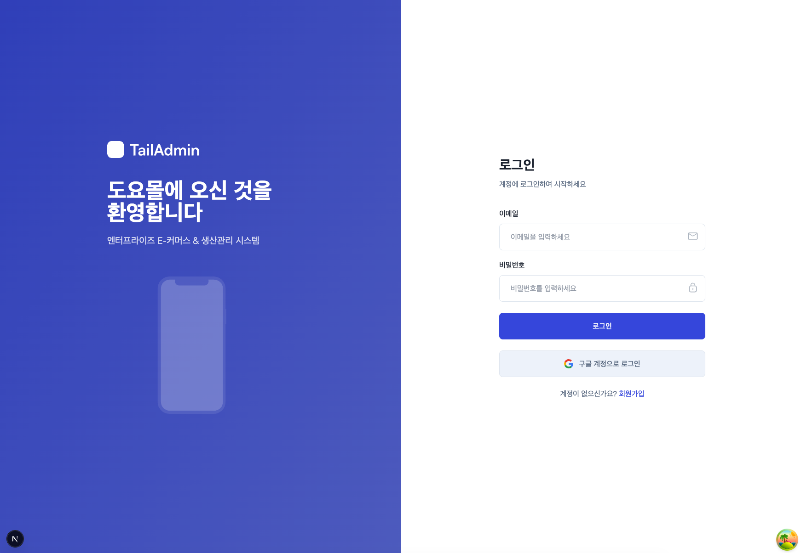
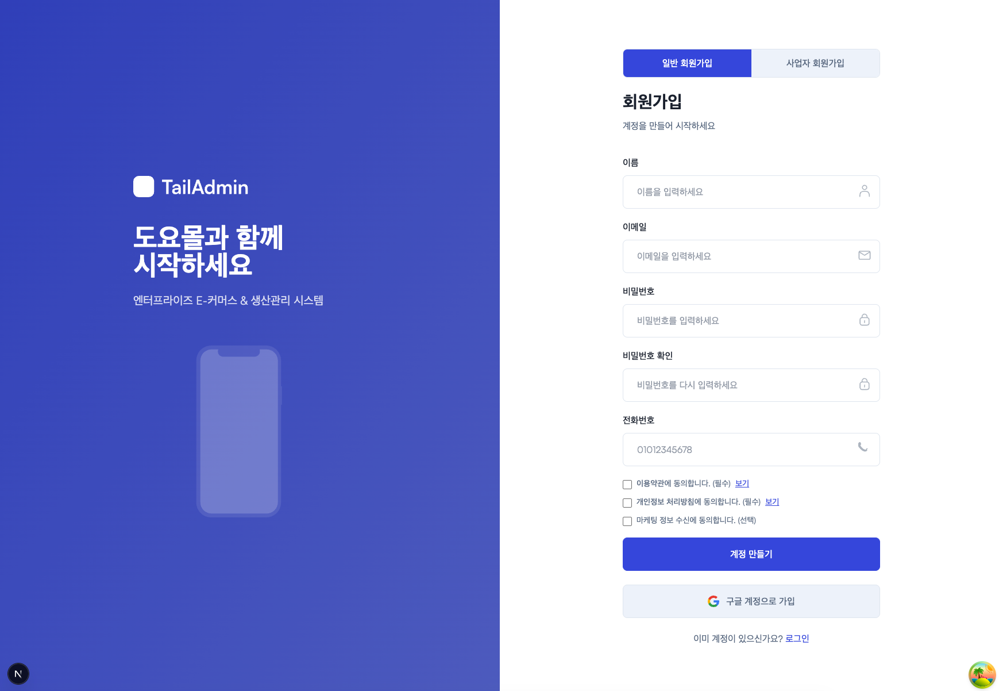
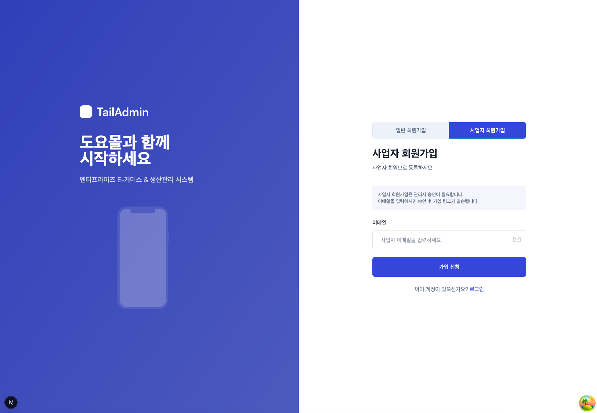

<div align= "center">
    
    </div>
    <div style="text-align: left;"> 
    <h2 style="border-bottom: 1px solid #d8dee4; color: #282d33;">  </h2>  
    <div style="font-weight: 700; font-size: 15px; text-align: left; color: #282d33;">  </div> 
    </div>
    <div style="text-align: left;">
    <h2 style="border-bottom: 1px solid #d8dee4; color: #282d33;"> 📂 Private Repo README </h2>
    </div>

<!-- PROJECTS:START -->
<details>
<summary><h3>📁 DoyoWorld Monorepo</h3></summary>

# DoyoWorld Monorepo

풀사이클 엔지니어링을 지향하는 모노레포입니다. 홈랩 인프라(K3s) 구축부터 웹/모바일 앱 배포까지, 서비스의 전체 라이프사이클을 다루고 있습니다.

**빌드**: Turborepo | **패키지 매니저**: pnpm 9 | **Node**: >= 18

---

## Projects Overview

| # | 프로젝트 | 설명 | 상태 |
|---|----------|------|------|
| 01 | [**FirstWing**](#01-firstwing--프로토타입) | 모노레포 구축 및 초기 PoC | 완료 |
| 02 | [**DevPulse**](#02-devpulse--ai-기술-뉴스-플랫폼) | AI 기반 기술 뉴스 요약 플랫폼 (Web + API + Mobile) | 운영 중 |
| 03 | [**ThirdWing**](#03-thirdwing--판금-업체-mvp) | 레이저 판금 업체 생산관리 MVP (Web + API) | 실험 |
| 04 | [**ForthWing**](#04-forthwing--멀티-벤더-이커머스) | 멀티 벤더 이커머스 마켓플레이스 (Web + API + Mobile) | 개발 중 |

---

## 01. FirstWing — 프로토타입

> 모노레포 환경 구축 및 Next.js 초기 개념 검증(PoC)

| App | 설명 | 기술 스택 |
|-----|------|-----------|
| [**FirstWing**](./apps/01-FirstWing) | 프로토타입 웹앱 | Next.js 14, React 18, TailwindCSS, ApexCharts |

<p align="center">
  
</p>

Turborepo + pnpm 워크스페이스 기반 모노레포의 첫 번째 앱으로, TailAdmin 템플릿을 활용한 대시보드 프로토타입입니다.

---

## 02. DevPulse — AI 기술 뉴스 플랫폼

> n8n + Gemini AI로 RSS 뉴스를 자동 수집/요약하여 모바일에서 제공하는 플랫폼

<p align="center">
  
  <br>
  <em>DevPulse 모바일 화면</em>
</p>

| App | 설명 | 기술 스택 |
|-----|------|-----------|
| [**SecondWing**](./apps/02-01-SecondWing) | 프론트엔드 (PWA) | Next.js 16, Tailwind, Shadcn UI, Apollo Client, GraphQL |
| [**SecondWind**](./apps/02-02-SecondWind) | 백엔드 API | NestJS 11, GraphQL (Apollo), Prisma, PostgreSQL |
| [**SecondWave**](./apps/02-03-SecondWave) | 모바일 하이브리드 앱 | Expo 54, React Native, WebView Bridge |

**핵심 기능**:
- n8n 워크플로우: RSS 수집 → 중복 필터 → 본문 추출 → Gemini AI 3줄 요약 → DB 저장
- Mobile-First PWA + 무한 스크롤 뉴스 피드
- Redis 캐싱으로 API 응답 최적화
- Expo + WebView 하이브리드 앱 (Play Store 배포 완료)
- Web↔Native Bridge 양방향 통신 (햅틱, 푸시 알림)

<p align="center">
  
  <br>
  <em>n8n 자동화 파이프라인</em>
</p>

---

## 03. ThirdWing — 판금 업체 MVP

> 레이저 판금 업체 PM으로서 레거시 대신 빠르게 구현한 생산관리 MVP

| App | 설명 | 기술 스택 |
|-----|------|-----------|
| [**ThirdWing**](./apps/03-01-ThirdWing) | 프론트엔드 | Next.js 14, Radix UI, React Query, Axios, Lucide |
| [**ThirdWind**](./apps/03-02-ThirdWind) | 백엔드 API | NestJS 11, GraphQL (Apollo), Prisma, PostgreSQL |

레이저 판금 업체에서 PM 역할을 수행하며, 레거시 소스 대신 Radix UI + React Query 조합으로 빠르게 MVP를 구현한 프로젝트입니다.

---

## 04. ForthWing — 멀티 벤더 이커머스

> 멀티 벤더 마켓플레이스 + 생산 관리 통합 엔터프라이즈 플랫폼

| App | 설명 | 기술 스택 |
|-----|------|-----------|
| [**ForthWing**](./apps/04-01-ForthWing) | 프론트엔드 (이커머스 웹) | Next.js 16, TailwindCSS, NextAuth, React Query, Zustand |
| [**ForthWind**](./apps/04-02-ForthWind) | 백엔드 API | NestJS 11, Prisma, PostgreSQL, JWT, MinIO, AWS SES |
| [**ForthWave**](./apps/04-03-ForthWave) | 모바일 앱 (예정) | Expo 54, React Native |

### 공개 페이지 (비회원)

<p align="center">
  
  <br>
  <em>도요몰 랜딩 — 인기 상품 캐러셀 + 카테고리 바로가기 + 신상품 인피니티 스크롤</em>
</p>

<p align="center">
  
  <br>
  <em>비회원이 보호 메뉴 접근 시 로그인 오버레이 (이메일 + Google OAuth)</em>
</p>

### 인증 시스템

<p align="center">
  
  
  <br>
  <em>로그인 / 일반 회원가입</em>
</p>

### 벤더(사업자) 승인 가입 플로우

<p align="center">
  
  
  <br>
  <em>사업자 가입 신청 → 접수 확인</em>
</p>

<p align="center">
  
  <br>
  <em>관리자 승인 후 AWS SES로 가입 링크 이메일 발송</em>
</p>

### 관리자 패널

<p align="center">
  
  <br>
  <em>사업자 가입 신청 관리 — 승인/거절/기한연장/재송신</em>
</p>

<p align="center">
  
  <br>
  <em>카테고리 관리 — 대분류/소분류 트리 구조 CRUD</em>
</p>

<p align="center">
  
  <br>
  <em>역할별 메뉴 권한 관리 (관리자/판매자/고객)</em>
</p>

### 벤더(판매자) 상품 관리

<p align="center">
  
  
  <br>
  <em>상품 등록 / 수정 — 카테고리 선택, 할인 설정, MinIO 이미지 업로드</em>
</p>

<p align="center">
  
  <br>
  <em>내 상품 목록 — 상태 필터 (판매중/비활성/품절/단종) + 검색</em>
</p>

**구현 현황**:

| Phase | 기능 | 상태 |
|-------|------|------|
| Phase 1 | 인증 (NextAuth JWT), 벤더 승인 가입 (AWS SES), 동적 메뉴 시스템 | 완료 |
| Phase 2 | 카테고리 관리, 상품 CRUD, MinIO 이미지 업로드, 공개 페이지 (랜딩/목록/상세) | 완료 |
| Phase 3 | 장바구니, 주문, 결제 (아임포트) | 예정 |
| Phase 4 | 쿠폰, 포인트 시스템 | 예정 |
| Phase 5+ | 리뷰/문의, FCM 알림, 정산, 생산 관리 | 예정 |

---

## Shared Packages

| 패키지 | 설명 |
|--------|------|
| [**@repo/eslint-config**](./packages/eslint-config) | 공유 ESLint 설정 (base, next-js, react-internal) |
| [**@repo/typescript-config**](./packages/typescript-config) | 공유 TypeScript 기본 설정 |
| [**@repo/ui**](./packages/ui) | 공유 React UI 컴포넌트 라이브러리 |

---

## Infrastructure

### Home Lab Server (MiniPC)

| 항목 | 사양 |
|------|------|
| CPU | AMD Ryzen 5 6600H (6C/12T, 3.3~4.5GHz) |
| RAM | 24GB DDR5 4800 |
| SSD | 512GB NVMe PCIe 4.0 |
| OS | Ubuntu 24.04 + K3s |
| 원격 접속 | RustDesk |

### K3s 서비스 현황

| 서비스 | 서브도메인 | 설명 |
|--------|-----------|------|
| FirstWing | `firstwing.doyosae.com` | 프로토타입 (Next.js) |
| DevPulse Web | `devpulse.doyosae.com` | 뉴스 웹앱 (Next.js PWA) |
| DevPulse API | `api-devpulse.doyosae.com` | 뉴스 API (NestJS GraphQL) |
| MinIO S3 | `s3.doyosae.com` | 오브젝트 스토리지 |
| MinIO Console | `s3-admin.doyosae.com` | 스토리지 관리 UI |
| n8n | `n8n.doyosae.com` | 자동화 워크플로우 |
| Portainer | `portainer.doyosae.com` | 컨테이너 관리 |
| PostgreSQL | — (내부) | 메인 데이터베이스 |
| Redis | — (내부) | 캐시 / 큐 |
| MongoDB | — (내부) | 문서 DB |
| DrawDB | `drawdb.doyosae.com` | DB 스키마 설계 도구 |
| Draw.io | `drawio.doyosae.com` | 다이어그램 도구 |

**네트워크**: Cloudflare Tunnel (포트포워딩 없이 HTTPS 외부 접속)
**도메인**: `doyosae.com` (가비아 구매 → Cloudflare 이관)
**CI/CD**: GitHub Actions + Self-hosted Runner + GHCR

---

## Monorepo Structure

```
DoyoWorld/
├── apps/
│   ├── 01-FirstWing/          # 프로토타입 (Next.js 14)
│   ├── 02-01-SecondWing/      # DevPulse Web (Next.js 16 + GraphQL)
│   ├── 02-02-SecondWind/      # DevPulse API (NestJS + GraphQL)
│   ├── 02-03-SecondWave/      # DevPulse Mobile (Expo + WebView)
│   ├── 03-01-ThirdWing/       # 대시보드 실험 (Next.js 14 + Radix UI)
│   ├── 03-02-ThirdWind/       # 대시보드 API (NestJS + GraphQL)
│   ├── 04-01-ForthWing/       # 이커머스 Web (Next.js 16 + TailAdmin)
│   ├── 04-02-ForthWind/       # 이커머스 API (NestJS + REST + Prisma)
│   └── 04-03-ForthWave/       # 이커머스 Mobile (Expo)
├── packages/
│   ├── eslint-config/         # 공유 ESLint 설정
│   ├── typescript-config/     # 공유 TypeScript 설정
│   └── ui/                    # 공유 UI 컴포넌트 라이브러리
├── turbo.json                 # Turborepo 빌드 파이프라인
└── pnpm-workspace.yaml        # pnpm 워크스페이스 정의
```

---

## Getting Started

```bash
# 의존성 설치
pnpm install

# 개별 앱 개발 서버
pnpm --filter first-wing dev     # 01 FirstWing
pnpm --filter second-wing dev    # 02 DevPulse Web
pnpm --filter second-wind dev    # 02 DevPulse API
pnpm --filter third-wing dev     # 03 ThirdWing
pnpm --filter forth-wing dev     # 04 ForthWing (이커머스)
pnpm --filter forth-wind dev     # 04 ForthWind (이커머스 API)

# 전체 빌드
pnpm build
```

---

## Tech Stack

| 영역 | 기술 |
|------|------|
| Frontend | Next.js 14~16, React 18~19, TailwindCSS, Shadcn UI, Radix UI |
| State | Zustand, React Query (TanStack), Apollo Client |
| Backend | NestJS 11, GraphQL (Apollo Server), REST, Prisma 5 |
| Auth | NextAuth v5, JWT, Passport.js, AWS SES |
| Database | PostgreSQL 16, Redis 7, MongoDB |
| Storage | MinIO (S3 호환, Self-hosted) |
| Mobile | Expo 54, React Native, WebView Bridge |
| Infra | K3s, Docker, Cloudflare Tunnel, GitHub Actions |
| AI/자동화 | Gemini AI, n8n 워크플로우 |
| CI/CD | GitHub Actions, Self-hosted Runner, GHCR |
| Dev Tools | Turborepo, pnpm 9, RustDesk, Claude Code |

</details>

<details>
<summary><h3>📁 ProjectNarae (나래)</h3></summary>

# ProjectNarae (나래)

새가 되어 하늘을 활강하며 실제 지역을 탐험하는 크로스플랫폼 앱.


실제 위성 사진과 고도 데이터를 불러와 3D 지형을 렌더링하고, 플레이어는 새의 시점으로 자유롭게 날아다닌다.
PC와 모바일 모두 지원한다.

---

## 핵심 기능

- 실제 위성 사진 기반 3D 지형 (ESRI / V-World / OpenStreetMap / Cesium Google Maps 3D Tiles)
- AWS Terrarium 고도 데이터로 실제 지형 높낮이 반영
- 새 주변만 자동 로딩/언로딩하는 청크 스트리밍
- 캐주얼한 비행 조작 (자동 전진 + 방향 + 고도 조작)
- Living Birds 에셋으로 리얼한 새 애니메이션

---

## 기술 스택

| 항목        | 사용 기술                                                                             |
| ----------- | ------------------------------------------------------------------------------------- |
| 엔진        | Unity 6                                                                               |
| 렌더링      | URP (Universal Render Pipeline)                                                       |
| 입력        | Unity Input System (크로스플랫폼)                                                     |
| 카메라      | Cinemachine 3.x (Third Person Follow)                                                 |
| 지도 시스템 | 기존 타일 (ESRI/OSM/V-World) + Cesium for Unity (Google Maps Photorealistic 3D Tiles) |
| 고도 데이터 | AWS Terrarium / Cesium World Terrain                                                  |
| 플랫폼      | PC (Windows/Mac) + 모바일 (Android/iOS)                                               |

---

## 조작법

### PC

| 키         | 동작                  |
| ---------- | --------------------- |
| W / S      | 피치 (위/아래 기울기) |
| A / D      | 좌우 회전             |
| Q (꾹)     | 고도 상승             |
| E (꾹)     | 고도 하강             |
| Shift (꾹) | 가속                  |
| C (꾹)     | 감속                  |
| 마우스     | 카메라 시점 조작      |

### 모바일

| 입력                 | 동작      |
| -------------------- | --------- |
| 가상 조이스틱 (왼쪽) | 방향 조작 |
| 부스트 버튼 (오른쪽) | 가속      |

---

## 비행 파라미터

| 파라미터       | 기본값 | 설명                         |
| -------------- | ------ | ---------------------------- |
| 기본 속도      | 15     | 활강 시 전진 속도            |
| 최저 속도      | 2.5    | 감속 한계                    |
| 최고 속도      | 80     | 가속 한계                    |
| 고도 조작 속도 | 20     | Q/E 고도 변경 속도           |
| 회전 속도      | 90°/s  | 좌우 회전 속도               |
| 뱅킹 각도      | 35°    | 회전 시 기울어지는 최대 각도 |
| 최소 고도      | 5      | 지면 근접 제한               |
| 최대 고도      | 200    | 상승 제한                    |

비행 파라미터는 `BirdModel` (ScriptableObject)로 관리하여 런타임 없이 튜닝 가능.

---

## 지도 시스템

### 타일 소스 (Inspector에서 전환 가능)

| 소스                      | 특징                     | API 키               |
| ------------------------- | ------------------------ | -------------------- |
| **ESRI Satellite** (기본) | 위성 사진                | 불필요               |
| OpenStreetMap             | 도로/건물 지도           | 불필요               |
| V-World                   | 한국 정부 위성 사진      | 필요                 |
| **Cesium for Unity**      | Google Maps 3D 타일 지원 | Cesium ion 토큰 필요 |

### 고도 데이터

AWS S3에서 무료 제공하는 Terrarium 고도 타일을 사용하여 실제 지형의 높낮이를 3D로 반영한다. API 키 불필요.
고도 스케일은 수평 압축 비율(TileWorldSize / 실제 타일 크기)에 맞춰 자동 보정된다.

### 지도 품질 파라미터

| 파라미터    | 기본값 | 설명                                         |
| ----------- | ------ | -------------------------------------------- |
| 줌 레벨     | 17     | 타일 해상도 (높을수록 선명, 타일 수 증가)    |
| 로딩 반경   | 7      | 플레이어 중심 로딩 타일 수 (15x15 = 225타일) |
| 언로딩 반경 | 10     | 이 밖의 타일은 메모리에서 제거               |
| 메시 해상도 | 32     | 타일당 지형 메시 버텍스 (32x32)              |
| 고도 과장   | 1.0    | 1 = 실제 비율, 높이면 지형 과장              |

---

## 개발 로드맵

### Phase 1 - 기본 비행 시스템 ✅

- [x] BirdInputHandler / BirdModel / BirdController 구현
- [x] Cinemachine 3인칭 카메라
- [x] 가속/감속, 고도 조작

### Phase 2 - 프로토타입 환경 ✅

- [x] Living Birds 에셋 연동
- [x] Simple Nature Pack 자연 환경 생성
- [x] 비행 파라미터 튜닝

### Phase 3 - 지도 연동 ✅

- [x] 위경도 ↔ 타일좌표 ↔ Unity좌표 변환
- [x] 위성 타일 로딩 (ESRI / OSM / V-World)
- [x] AWS Terrarium 고도 데이터 연동
- [x] 청크 기반 스트리밍 (새 주변만 로딩)
- [x] 실제 비율 고도 스케일 자동 보정 (수평 압축 비율 연동)
- [x] 지형 위 자동 스폰 (첫 타일 고도 기준)

### Phase 3.5 - 지도 해상도 개선 ✅

- [x] 줌 레벨 15→17 (타일 해상도 4배 향상, ~1m/px)
- [x] 타일 텍스처 품질: 밉맵 생성, Trilinear 필터, 이방성 필터링(x8)
- [x] 스트리밍 반경 확대 (loadRadius 7, unloadRadius 10)

### Phase 4 - 모바일/UI 최적화

- [x] 화면 조작 UI (OnScreenControls) — 터치/클릭 버튼 + 키보드 연동
- [ ] 모바일 품질 설정 적용
- [ ] 성능 프로파일링 및 최적화

### Phase 5 - 컨텐츠 확장 및 추가 연동

- [x] Cesium for Unity 연동 (Google Photorealistic 3D Tiles)
- [ ] 미니맵 HUD 시스템
- [ ] 건물 데이터 로딩 및 렌더링
- [ ] 게임 컨텐츠 방향 결정

</details>

<details>
<summary><h3>📁 Portfolio</h3></summary>

# Portfolio

Next.js 기반 이력서 & 포트폴리오 웹사이트입니다.

🔗 [doyosae.com](https://www.doyosae.com)

</details>

<p align="right"><sub>🔄 프라이빗 레포에서 GitHub Actions로 자동 동기화됨</sub></p>
<!-- PROJECTS:END -->

<div style="text-align: left;">
    <h2 style="border-bottom: 1px solid #d8dee4; color: #282d33;"> 🛠️ Tech Stacks </h2> <br>
    <div style="margin: ; text-align: left;" "text-align: left;">
          
          
          
          
          <br/>
          
          
          
          
          <br/>
          
          
          
          
          <br/>
          
          
          
          
          </div>
    </div>
    <div style="text-align: left;">
    <h2 style="border-bottom: 1px solid #d8dee4; color: #282d33;"> 🧑‍💻 Contact me </h2> <br>
    <div style="text-align: left;"> <a href=mailto:ehdgydi@gmail.com>  </a>
          </div>  <br>
    <div style="text-align: left;">  </div>
    </div>
    <div style="text-align: left;">
    <h2 style="border-bottom: 1px solid #d8dee4; color: #282d33;">

🏅 Stats </h2>
<div style="text-align: left;">


 </div>
